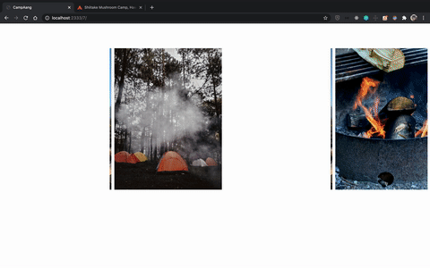

# CampAang Photo Module

Web application for campsites browsing and booking.
This is the photo carousel module in this project

## Usage

> Please use this module with related project ( booking module, overview module, banner module )

## Related Projects

Services

- Booking: https://github.com/hrr46-fec-aang/bookingservice
- Overview: https://github.com/hrr46-fec-aang/listingservice
- Banner: https://github.com/hrr46-fec-aang/bannerservice

Proxy
https://github.com/hrr46-fec-aang/jing-proxy



# Table of Contents

1. [Prerequisites](#Prerequisites)
1. [Development](#development)
1. [Server Endpoints](#Server-Endpoints)
   - [GET /api/reviews](#GET)
   - [GET /api/reviews/:reviewid](#GETONE)
   - [PUT /api/reviews/:reviewid](#PUT)
   - [POST /api/reviews](#POST)
   - [DELETE /api/reviews/:reviewid](#DELETE)

## Prerequisites

You need Node.js (v12.16.1) and MongoDB (v4.2.1) installed to run this app on your local device.

## Development

### Installing Dependencies

```sh
npm install
```

### Seeding Database

```sh
npm run db:setup
```

### Starting Webpack

```sh
npm run build
```

### Starting Server

```sh
npm start
```

### Start Testing

- Run test with coverage report

```sh
npm run test:coverage
```

## Server Endpoints

### GET

Getting reviews for an itemid : /api/reviews?id={}

- GET Request
- Expected Queries: id
- Responses with randomly generated 2 to 8 reviews

### GETONE

Getting reviews for an itemid : /api/reviews/:reviewid?id={}

- GET Request
- Expected Queries: id
- Eepected Params: reviewid
- Responses with one review according to the reviewid

### PUT

Updating like/dislike : /api/reviews/:reviewid?id={}

- PUT Request
- Expected Queries: id
- Expected Params: reviewid
- Expected Body:
  => like: boolean variables indicate if it's like or dislike

### POST

Post one review: /api/reviews?id={}

- POST Request
- Expected Queries: id
- Expected Body:
  => name: username of the review author
  => location: user location
  => timestamp: time of posting review
  => title: review title
  => comment: review content

### DELETE

Delete a review by its id : /api/reviews/:reviewid?id={}

-DELETE Request

- Expected Queries: id
- Expected Params: reviewid

## Authors

- **Jing Chen** - _Initial work_ - [CampAang-Photo Carousel](https://github.com/hrr46-fec-aang/photoservice)
